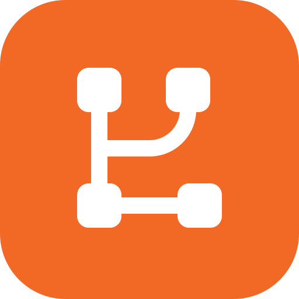

<div align="center">


# Loginom Dock

Знания Loginom и инструменты для Codex и Hermes на основе OpenViking.

[План](docs/plans/2026-09-02-loginom-dock-implementation-plan.md) · [Архитектура](docs/loginom-dock/architecture.md) · [Разработка](docs/loginom-dock/development.md) · [Статус](docs/loginom-dock/implementation-status.md)

</div>

Dock сохраняет ресурсы, skills, поиск, память, сессии, API, MCP и Studio OpenViking.
Задачи в Loginom выполняет подключённый агент с локальным браузером. Репозитории
`ai-skills`, `e2e-tests` и `loginom-help` должны стать общей базой знаний Dock.

Проект находится в разработке. Базовый интерфейс и сервер получают брендирование;
единый клиентский MCP, native-плагины, импорт источников и общий очищенный архив
проходят отдельные этапы реализации. Готовых клиентских релизов пока нет.

## Сборка

Compose собирает сервер и Studio из этого репозитория и хранит данные в отдельном
томе Dock. Для сборки нужен запущенный Docker с Compose:

```sh
docker compose build
```

Порядок первичной настройки отдельного конфига и запуска описан в
[руководстве разработчика](docs/loginom-dock/development.md). Сервер по умолчанию
публикуется только на `127.0.0.1:1933`, Studio — `/studio/`, MCP — `/mcp`.
Публичное развёртывание с HTTPS и общим аккаунтом проверяется отдельно.

## Совместимость и происхождение

Loginom Dock — форк [OpenViking](https://github.com/volcengine/OpenViking),
распространяемый по [AGPL-3.0](LICENSE). Сохранены copyright, внутренние имена
пакетов, формат хранилища, URI `viking://` и API-заголовки OpenViking.

- [Исходный README OpenViking](README_UPSTREAM.md)
- [Документация базовых возможностей](docs/en/getting-started/01-introduction.md)
- [OpenViking Assets](docs/en/guides/18-openviking-assets.md)
- [Исходный код Loginom Dock](https://github.com/kartamyshev-dev/loginom-dock)
- [Ошибки и предложения](https://github.com/kartamyshev-dev/loginom-dock/issues)

Upstream-примеры плагинов сохранены для повторного использования. Они не являются
готовыми плагинами Loginom Dock и используют собственную конфигурацию OpenViking.
