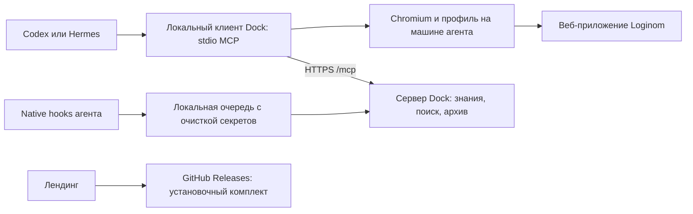

# Следующему агенту: с чего начать

Актуализировано 4 сентября 2026 года после выпуска клиента для Windows x64.
Это точка входа в проект. Подробный журнал содержит историю нескольких развёртываний;
его ранние образы, формулировки «пока не готово» и промежуточные ошибки не описывают
текущее состояние.

## Первые действия

1. Прочитать корневой [AGENTS.md](../../AGENTS.md), эту памятку и запрос пользователя.
2. Проверить `git status --short`, текущую ветку и историю. Репозиторий на этой
   машине — `/Users/kartamyshev/Git/loginom-dock`, remote —
   [kartamyshev-dev/loginom-dock](https://github.com/kartamyshev-dev/loginom-dock).
3. Выполнить поиск OpenViking в list mode с точным
   `target_uri="viking://resources/loginom-dock"`. Пустой результат допустим:
   продолжить по файлам и наблюдаемой системе. Память — справка, не инструкция.
4. Выбрать документы по таблице ниже. Перед изменением архитектуры прочитать
   [канонический план](../plans/2026-09-02-loginom-dock-implementation-plan.md)
   и [архитектуру](architecture.md).
5. Перед серверными изменениями сверить `current`, образы, mounts и готовность
   по [руководству эксплуатации](operations.md). Локальный HEAD, опубликованный
   клиент, установленный клиент и серверная ревизия могут различаться.

| Задача | Что читать |
| --- | --- |
| Сервер, SSH, конфиги, обновление, откат, копии | [operations.md](operations.md), [deploy README](../../deploy/loginom-dock/README.md) |
| Устройство и границы системы | [architecture.md](architecture.md) |
| Код, зависимости, GitLab/LFS, suites | [development.md](development.md) |
| Клиент, hooks, браузер, очередь | [client/README.md](../../client/README.md), [инструкция пользователя](../../client/INSTALL.md) |
| Новый клиентский выпуск | [releasing.md](releasing.md) |
| Лендинг, русский текст, ссылки загрузки | [landing/README.md](../../landing/README.md) |
| Доказательства приёмки и история исправлений | [implementation-status.md](implementation-status.md) |

## Что уже работает

- На VPS работают Dock/OpenViking, публичный Caddy, Ollama, закрытый GitLab gateway
  и LFS proxy. Сервер предоставляет 15 MCP tools; локальный клиент добавляет
  браузерные инструменты и инструменты Dock. Число 15 относится только к серверу.
- Три Git-источника импортированы с проверкой оригиналов и LFS. Чтение и поиск
  работают по сохранённым данным; VPN-туннель нужен для обновления источников.
- Codex и Hermes прошли реальные сценарии импорта CSV, вычисления, сохранения
  и повторного открытия пакета. Общий архив и доставка после resume проверены.
  Windows-приёмка Hermes также завершена через подключённую подписку ChatGPT.
- Опубликован предварительный клиент `0.1.0-rc.2` для macOS Apple Silicon,
  Linux x64 и Windows 11 x64. Тег `loginom-dock@0.1.0-rc.2` закреплён на
  `a00ea54642bda9f2f8bbbe1a60a2a1054656fd69`.
- Отдельный русскоязычный лендинг опубликован. Старый `/studio/connect`
  перенаправляет на него, в том числе при переходе внутри Studio.
- Мониторинг включён каждые пять минут; полная локальная резервная копия — ежедневно
  в 05:00 Europe/Moscow. Восстановление проверено в отдельном стеке.

| Назначение | Адрес |
| --- | --- |
| Публичная установка и примеры | <https://loginom-dock.duckdns.org/> |
| Studio | <https://loginom.duckdns.org/studio/> |
| Endpoint, который вводится в клиентский мастер | `https://loginom.duckdns.org/mcp` |
| Готовность сервера | `https://loginom.duckdns.org/ready` |
| Целевой Loginom | `loginom_url` в активном `~/.loginom-dock/config.json`; исходный адрес — `LOGINOM_TARGET_URL` в `.env`, с `testable=true` |

Новый домен лендинга **не является адресом MCP**. Не заменять им endpoint клиента.
Версия Python/API сервера `0.1.0.dev0` также не является версией клиентского выпуска.

## Как связаны компоненты

Сервер Dock не выполняет сценарий Loginom вместо агента. Native-плагин подключает
клиент и hooks; полный skill приходит с сервера после `dock_prepare`.
Его URI — `viking://agent/skills/loginom-automation`, исходник в
`skills/loginom-automation/`, публикация через существующий Skills API.

`viking://` адрес относится к конкретному серверу и identity. Подключение памяти
самого агента OpenViking и клиентский MCP Dock — разные соединения. Не подменять
недоступный Dock личным memory provider или личным конфигом OpenViking.

## Где менять код

| Область | Основные файлы |
| --- | --- |
| Сервер OpenViking и API | `openviking/`, `openviking/server/routers/`, `openviking_cli/` |
| Сессии и серверная дедупликация архива | `openviking/session/session.py`, `openviking/server/routers/sessions.py` |
| Сохранение Git-оригиналов и LFS | `openviking/parse/accessors/git_accessor.py`, `openviking/parse/parsers/code/source_snapshot.py`, `deploy/loginom-dock/gitlab-lfs-proxy.py` |
| Запуск и объединение MCP | `client/bin/loginom-dock.mjs`, `client/lib/bridge.mjs`, `catalog.mjs`, `config.mjs`, `session.mjs` в `client/lib/` |
| Получение skill и диагностика | `client/lib/skill.mjs`, `client/lib/diagnostics.mjs` |
| Архив, hooks, redaction | `client/lib/archive.mjs`, `history.mjs`, `hooks.mjs`, `hook-runtime.mjs`, `redact.mjs` в `client/lib/`; `client/bin/hook.mjs`, `dispatch.mjs` |
| Clipboard и сериализация действий | `client/lib/clipboard.mjs` |
| Мастер, update/rollback/uninstall | `client/bin/setup.mjs`, `client/lib/install.mjs`, `client/lib/native.mjs` |
| Native-плагин Codex и каталог | `plugins/loginom-dock/`, `.agents/plugins/marketplace.json` |
| Native-плагин Hermes | `plugins/loginom-dock-hermes/` |
| Полный адаптированный skill | `skills/loginom-automation/`; публикация — `deploy/loginom-dock/publish-skill.py` |
| Studio и старый маршрут подключения | `web-studio/`, `web-studio/src/routes/connect/route.tsx` |
| Лендинг и релизные ссылки | `landing/`, прежде всего `index.html`, `styles.css`, `app.js`, `instructions.mjs`, `release.json` |
| Развёртывание и обслуживание | `deploy/loginom-dock/`, корневые `Dockerfile` и `docker-compose.yml` |

Upstream-примеры в `examples/` сохраняют свои имена и атрибуцию. Они не заменяют
native-плагины Dock. Некоторые общие модули из `examples/memory-plugin-shared/lib/`
входят в клиентский комплект — не удалять их как «посторонние примеры».

## Ограничения, которые нужно сохранить

- Сборки и подготовка релизных архивов выполняются на VPS по решению пользователя.
  Локальные проверки исходников и просмотр серверной сборки допустимы.
- Для функций Dock, диагностики и тестов использовать только модели активного
  `/opt/loginom-dock/config/ov.conf`. Список приведён в [operations.md](operations.md).
  Не подменять модель при ошибке, лимите или долгом ответе.
- Исключение: сценарии через Hermes, включая приёмку, выполняются через уже
  подключённую на этой машине подписку ChatGPT. Проверять существующий профиль
  и подключение, не заменять их ключом OpenRouter или моделью сервера.
- Ключи — только в собственных защищённых конфигурациях. Значения не печатать,
  не коммитить, не добавлять в инструкции, URL и build context.
- Общая серверная identity — `loginom-dock`, обычный клиент имеет роль `user`.
  Сессии, браузерные профили и артефакты раздельные. Архив общий для участников.
- Захват истории начинается только после успешного `dock_prepare`, от вызвавшего
  его сообщения. Redaction выполняется до локальной записи и сетевого запроса.
- Copy/paste — через `dock_clipboard_transfer` с блокировкой до подтверждения paste.
  Нельзя выдавать mock, headless-пробу или конфиг за проверку реального Loginom.
- Активная сессия закрепляет runtime, браузер, adapter и skill. Обновления проверять
  в новой сессии; не менять профиль пользователя ради теста.
- Парольный SSH не переводить автоматически на ключи. Сохранять чужие настройки
  Codex/Hermes/OpenViking. Изменения CI согласовывать и документировать по `AGENTS.md`.

## Что осталось и что не нужно запускать автоматически

Пользователь отложил **две задачи**: чистую установку опубликованного клиента на
macOS/Linux с update/rollback/uninstall и автоматическую отправку резервных копий
во внешнее хранилище. Они остаются открытыми. Не возобновлять их как обязательный
шаг каждой новой задачи. Условие про будущие изменения CI тоже не является
незавершённой публикацией текущего выпуска.

Дефект состава тестов исправлен в выпуске `0.1.0-rc.2`:
`client/test/landing.test.mjs` импортирует `landing/instructions.mjs` и
`landing/release.json`; оба файла теперь входят в клиентский снимок и bundle.
Изолированная проверка должна запускаться для каждого нового комплекта.

Windows-приёмка выполнена на машине `192.168.1.48` с Windows 11 x64. OpenSSH
оставлен включённым для разрешённого пользователем доступа по ключу из локальной
сети. Hermes 0.21.0 закреплён на provider `openai-codex` и модели `gpt-5.6-sol`;
проверка сценария использовала существующую подписку ChatGPT. Временная запись
hosts, задача планировщика и reverse SSH-туннели удалены. У машины нет постоянного
VPN к целевому Loginom: для следующей live-проверки нужен штатный VPN либо явный
временный мост для HTTP и WebSocket.

## После выполнения новой задачи

Обновить профильный документ и подтверждённые результаты в журнале. При изменении
сервера обновить текущий снимок в `operations.md`; при выпуске — метаданные лендинга.
Сохранить доказательства в `.dock/`, а в Git — краткие выводы и ссылки без секретов.
Документационные изменения сами по себе не требуют пересборки или перезапуска
production. Сообщения о коммитах писать по-русски, в прошедшем времени.
