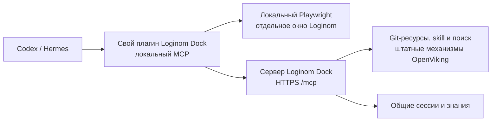

# Loginom Dock: план работ

Дата: 2 сентября 2026 года. Статус: согласованные решения и план реализации.
Этот документ объединяет первоначальный план и последующие уточнения пользователя.
Наличие пункта в плане не означает, что соответствующая функция уже реализована.

Ход выполнения и результаты проверок: [журнал реализации](../loginom-dock/implementation-status.md).

Уточнение пользователя от 3 сентября 2026 года: на потом отложены проверка
чистой установки из опубликованного релиза на macOS/Linux (включая обновление,
откат и удаление) и автоматическая отправка резервных копий на внешнее хранилище.
Эти задачи остаются открытыми, но исключены из текущего объёма работ. Сейчас
остаются полная приёмка Hermes, выпуск пакетов и остальные итоговые проверки
с обновлением документации.

## 1. Цель и принятые решения

Loginom Dock — продуктовый форк [OpenViking](https://github.com/volcengine/OpenViking).
Существующие возможности OpenViking сохраняются: работа с репозиториями, ресурсами,
skills, поиском, памятью, сессиями, MCP, API и веб-интерфейсом. Разработка Dock
опирается на эти механизмы и добавляет интеграцию с Loginom и клиентскими агентами.

- Продукт называется **Loginom Dock**.
- Задачу пользователя выполняет подключённый **Codex или Hermes**.
- Skill `loginom-automation` и необходимые исходные материалы хранятся внутри Dock.
- `ai-skills`, `e2e-tests` и `loginom-help` подключаются как Git-ресурсы штатными
  средствами OpenViking. Их содержимое хранится и индексируется в Dock.
- У клиента регистрируется одно MCP-подключение `loginom-dock`. Локальный компонент
  плагина объединяет удалённые инструменты Dock и встроенные инструменты Playwright.
- Браузер работает на машине агента в отдельном окне и профиле Dock. Первая версия
  поддерживает macOS и Linux; видимое окно требует графической сессии.
- Все пользователи работают с общим аккаунтом и общей рабочей identity
  `loginom-dock`. Знания и архивы доступны всем подключённым участникам.
- Браузерные профили, активные задачи и локальные артефакты разных клиентских
  сессий независимы. Последовательности copy/paste между сессиями Dock на одной
  машине сериализуются: системный clipboard не изолируется профилем браузера.
- Все активированные сессии Loginom архивируются после очистки секретов.
- Параметры embedding-модели и LLM берутся из текущего OpenViking и отдельно
  настраиваются для Dock. Персональные данные существующего OpenViking не мигрируют.

## 2. Исходные системы и повторное использование

### Репозитории и стенды

| Источник | Текущее расположение | Ветка / назначение |
| --- | --- | --- |
| Loginom Dock | `https://github.com/kartamyshev-dev/loginom-dock.git` | `main` |
| ai-skills | `http://git.basegroup.ru/testing/ai-skills.git` | `master`; источник skill |
| e2e-tests | `http://git.basegroup.ru/testing/e2e-tests.git` | `master`; селекторы, helpers, тесты и данные |
| loginom-help | `http://git.basegroup.ru/support/loginom-help.git` | `master`; продуктовая справка |
| Сервер Dock | `82.22.23.10`, домен `loginom.duckdns.org` | Развёртывание и испытания Dock |
| Тестовый Loginom | `http://dev-test.bg.local/staging/app-debug/?testable=true` | Доступ с машины агента через внутреннюю сеть/VPN |

Локальный источник skill, указанный пользователем:
`/Users/kartamyshev/Git/ai-skills/agents/skills/loginom-automation`.
При исследовании содержимое этого каталога совпадало с файлами прежнего расположения
`.agents/skills/loginom-automation` в Git; перенос каталогов ещё не был закоммичен.
При импорте зафиксировать фактический путь и ревизию источника, затем вести
адаптированную версию skill в репозитории Dock.

Пароли, токены и приватные ключи в план, Git и опубликованные артефакты не включаются.

### Уже существующие механизмы

| Возможность | Основа реализации |
| --- | --- |
| Импорт Git, структура исходников, индексация | `GitAccessor`, `CodeRepositoryParser`, `add_resource` |
| Описание набора репозиториев | OpenViking Assets: manifest/catalog и state |
| Обновление источников | Повторный импорт, Watches |
| Поиск и чтение | MCP `find`, `search`, `grep`, `glob`, `read`, `list`, `tree` |
| Хранение и выдача skills | Существующий Skills API, manifest, revision и SHA-256 |
| Сессии и извлечение знаний | Существующие session/memory API и службы OpenViking |
| Клиентский транспорт и hooks Codex | Имеющиеся plugin examples и общие библиотеки |
| Веб-интерфейс и эксплуатация | Studio, Docker, Caddy, существующие проверки и метрики |

Дополнения Dock должны сохранять действующие MCP/API-возможности. Отдельный
импортёр репозиториев, поисковый движок или параллельное хранилище не создаются.
Новые MCP-инструменты добавляются только для отсутствующих операций доставки skill,
подготовки клиентской среды и диагностики.

## 3. Этапы реализации

### Этап 1. Контракт продукта и брендирование

- [x] Закрепить архитектуру и правила проекта в документации и `AGENTS.md`.
  Канонический проектный URI: `viking://resources/loginom-dock`.
- [ ] Обновить README, название и ссылки веб-интерфейса, иконки, описания MCP,
  плагинов и релизных артефактов на Loginom Dock; использовать существующую тему UI.
- [x] Сохранить внутренние имена OpenViking, URI, совместимость хранения и
  upstream-атрибуцию. Учесть обновления upstream без массового переименования кода.
- [x] Настроить собственный контейнер из этого репозитория: Compose переключён
  на сборку Dock из checkout и отдельное хранилище. Серверная сборка и live-приёмка
  фиксируются в журнале реализации.

Результат: брендированная базовая сборка с сохранёнными возможностями OpenViking.

### Этап 2. Репозитории внутри Dock и временный доступ к GitLab

- [x] Описать три Git-источника штатным manifest/catalog OpenViking Assets.
  Назначить стабильные целевые URI под `viking://resources/loginom-dock`.
- [x] Поднять reverse SSH с машины, имеющей доступ к закрытому GitLab, на сервер
  Dock. Ограничить доступ к туннелю сервером и его средой импорта.
- [x] Проверить маршрут именно из контейнера Dock: loopback сервера и loopback
  контейнера различаются. Использовать конкретное имя разрешённого Git-хоста.
- [x] Согласовать транспорт с существующей авторизацией GitLab. Для HTTP GitLab
  и PAT предусмотреть внутренний HTTPS-вход перед туннелем: штатный
  `args.auth_config` принимает Git credentials только для HTTPS. Существующий
  разрешённый SSH-доступ к GitLab также может использоваться. Авторизацию не
  менять автоматически на ключевую.
- [x] Настроить точный GitLab/tunnel host в штатном списке разрешённых кодовых
  хостов; глобальное разрешение частных сетей не требуется.
- [x] Проверить Git LFS batch/object endpoints, реальные файлы вместо pointers и
  наличие необходимых клиентских компонентов в контейнере.
- [x] Импортировать содержимое рабочих ревизий репозиториев, включая необходимые
  данные и изображения. Под полнотой понимаются исходные файлы выбранной ревизии;
  история `.git`, локальные зависимости и кэши не требуются.
- [x] Сопоставить ожидаемые файлы с сохранёнными ресурсами. Стандартный parser
  фильтрует dotfiles, `.gitignore`, некоторые binary formats и файлы больше 10 MiB.
  Настроить импорт и при необходимости внести узкие исправления сохранения
  пропущенных материалов, используя существующие службы ресурсов.
- [x] Текст кода и справки обрабатывать штатным поиском. Для бинарных fixtures
  сохранять исходные файлы и доступные описания/связи с тестами; наличие файла не
  считать доказательством семантического разбора его содержимого.
- [x] Проверить поиск без соединения с GitLab: после импорта туннель нужен только
  для загрузки новых версий. Для первого выпуска обновления запускать явно;
  последующее расписание настраивается через существующие Watches.

При публикации исходников на GitHub перенастроить источники и Watches с сохранением
целевых URI ресурсов. Смена locator меняет asset identity в Assets, поэтому отдельно
переоформить привязки State и остановить старые Watches перед подключением новых.
Клиентские плагины продолжают обращаться к тем же ресурсам Dock.

Результат: репозитории доступны для чтения и качественного поиска внутри Dock;
локальные копии исходников на клиентских компьютерах не нужны.

### Этап 3. Локальный MCP-компонент и первый сквозной прототип

- [x] Создать общий компонент на Node.js и MCP SDK, переиспользовав имеющиеся
  транспортные и конфигурационные части. Компонент сам обслуживает initialization,
  объединяет каталоги инструментов и управляет дочерним Playwright MCP.
- [x] Сохранить инструменты OpenViking; добавить браузерные инструменты и локальные
  операции подготовки/диагностики. Коллизии имён отклонять явно.
- [x] Поставлять закреплённую версию Playwright MCP. Описания и схемы его инструментов
  получать от установленной версии; фиксировать каталог на клиентскую сессию.
- [x] Использовать собственные настройки и credentials Dock. Не подхватывать
  автоматически личный `ovcli.conf` пользователя или его OpenViking endpoint.
- [x] Создавать независимый браузерный профиль для каждой активной клиентской
  сессии; оставлять итоговую вкладку открытой до завершения клиентской среды.
- [x] Удерживать общую для сессий Dock на машине блокировку от copy до
  подтверждённого paste. Освобождать её при завершении или прерывании операции;
  проверять отсутствие перемешивания параллельных переносов.
- [ ] Проверить DOM, реальные координатные drag, clipboard, dialogs, загрузку
  файлов, скриншоты и длительные ожидания Loginom.
- [ ] Выполнить ранний прототип на обоих агентах: получить skill и источники через
  Dock, добавить узлы и создать между ними реальную связь на тестовом стенде.

Результат: подтверждена наиболее рискованная часть — единое подключение со знаниями
и работоспособным локальным браузером для Codex и Hermes.

### Этап 4. Адаптированный skill и два native-плагина

- [x] Разделить общие инструкции Loginom и небольшие адаптеры клиентских агентов.
  Убрать обязательные локальные пути к репозиториям и Context7.
- [x] Обучить skill использовать штатные `find/search` в нужном URI, точные
  `grep/glob`, затем `read` полного источника и связанных helpers.
- [x] Сохранить приоритет исходников и live DOM над извлечёнными воспоминаниями.
  Выдавать путь и доступную информацию о версии источника вместе с результатом.
- [x] Адаптировать browser recipes к проверенным возможностям компонента Dock,
  сохранив `data-tid`, ожидания, проверки ошибок и восстановление.
- [x] Переписать Save As: подтверждать сохранение повторным открытием или
  скачиванием `.lgp`; не предполагать наличие локального каталога `integration`.
- [x] Установить постоянный загрузочный skill. Локальный `dock_prepare` проверяет
  сервер, загружает полный пакет в собственный кэш, проверяет manifest/хеши/пути
  и возвращает основные инструкции в текущий контекст агента.
- [x] Не полагаться на обнаружение нового файла skill после начала разговора.
  Новая версия активируется атомарно; ревизии закреплены до конца сессии.
- [x] Для Codex подготовить native plugin, `.mcp.json`, загрузочный skill и hooks.
- [x] Для Hermes подготовить `plugin.yaml`, регистрацию namespaced skill,
  короткую bootstrap/system-prompt section и hooks. Учитывать текущий профиль
  `HERMES_HOME`; сохранить существующий личный `memory.provider`.
- [x] Передавать тип агента и версию адаптера явно; `clientInfo` использовать
  дополнительно для диагностики, а не для определения полномочий.

Результат: после установки пользователь ставит обычную задачу Loginom, и агент
получает правильные инструкции и инструменты без ручного копирования skill.

### Этап 5. Общий архив сессий и накопление знаний

- [x] Использовать session/memory службы OpenViking. Дополнить клиентскую доставку
  событий там, где существующие плагины не обеспечивают нужную полноту.
- [x] Активировать архив после успешного `dock_prepare`, начиная с вызвавшего его
  пользовательского сообщения. Остальные разговоры не выгружать; resume той же
  сессии сохраняет активацию, новый разговор активируется самостоятельно.
- [x] Хранить полный текст пользовательских сообщений и видимых ответов, вызовы
  и очищенные результаты инструментов, статусы, ревизии и ссылки на артефакты.
  Большие результаты обрабатывать существующим механизмом внешнего хранения;
  пропуски и ограничения явно отмечать.
- [x] Очищать секреты до записи в локальную очередь и до любого HTTP-запроса:
  известные credential values, credential-поля, cookies, Authorization,
  приватные ключи и секреты в URL. При ошибке очистки отправлять диагностическую
  отметку без сырого содержимого.
- [x] Не включать скрытые рассуждения и системные инструкции. Изображения,
  browser profile и бинарные файлы остаются локально; их публикация выполняется
  отдельным явным действием пользователя.
- [x] Добавить устойчивую локальную очередь, подтверждение доставки, повторную
  отправку и дедупликацию по installation/session/turn/tool-call identity.
  Исключить операции доставки архива из собственного capture.
- [x] Для Codex использовать hooks и сверку transcript. Для Hermes — native hooks
  и read-only сверку активированной истории, включая сообщения до compaction и
  compression lineage. Учитывать, что Hermes `on_session_end` вызывается по turn.
- [x] Проверить совместную установку с существующим OpenViking-плагином: отдельные
  endpoint/credential/state namespaces, без двойной отправки одного события в Dock.
- [x] При обрывах и аварийном завершении отражать неполноту; незаписанные streaming
  fragments не считать восстановленными.
- [x] Из общего архива извлекать знания о Loginom с источниками. Не создавать
  смешанный персональный профиль участников. Автоматическое удаление общей
  истории в первую версию не включать.

Результат: участники находят общую историю и подтверждённый опыт работы с Loginom.

### Этап 6. Доставка плагинов, установка и подключение пользователей

**Канал доставки:** GitHub-репозиторий и версионированные релизы Loginom Dock.
**Точка входа:** будущая страница «Подключить» на сайте Dock с выбором Codex/Hermes.
Включение в публичные каталоги OpenAI или Hermes не является условием первого релиза.

- [ ] Подготовить два native-пакета и общий локальный runtime. Каждый пакет
  содержит собственный launcher/skill/hooks и не зависит от соседних каталогов
  checkout; runtime доставляется как проверенный релизный артефакт.
- [ ] Выпускать проверенные артефакты для заявленных macOS/Linux платформ с
  версиями, контрольными суммами, требованиями к агенту и совместимостью с Dock.
- [x] Подготовить Codex marketplace в репозитории и готовую инструкцию его
  подключения. Установку выполнять штатным менеджером плагинов Codex.
- [ ] Для Hermes использовать штатную установку native plugin из подкаталога
  GitHub-репозитория с закреплённым полным commit SHA и явным включением.
- [ ] Создать установщик/мастер Dock: проверить агента и ОС, подготовить среду
  выполнения и Chromium, выбрать профиль агента, сохранить endpoint и ключ,
  запросить адрес Loginom, зарегистрировать одно локальное MCP-подключение.
- [x] Runtime и браузер размещать в управляемом каталоге данных Dock; существующие
  системные установки Node.js/Python не переустанавливать. Отсутствие графической
  сессии объяснять в диагностике готовности видимого браузера.
- [x] По умолчанию предлагать `https://loginom.duckdns.org/mcp`; поддержать другой
  Dock endpoint в настройках. Ключ вводится локально, без записи в историю команд,
  Git, ссылки установки или чат агента.
- [x] Настройки менять идемпотентно только в записях Dock; сохранять остальные
  MCP-подключения и настройки пользователя. До замены сохранять возможность отката.
- [x] В мастере ясно сообщить, что активированные сессии Loginom попадают в общую
  базу Dock после очистки секретов.
- [x] Выполнить итоговую диагностику: аутентификация, сервер, источники, получение
  skill, готовность браузера и доступность целевого Loginom.

Пользовательский путь:

| Клиент | Что делает пользователь |
| --- | --- |
| Codex | Открывает страницу Dock, добавляет предложенный каталог, устанавливает Loginom Dock, проходит мастер подключения и начинает новую задачу |
| Hermes | На машине Hermes выполняет готовую инструкцию установки, выбирает профиль, проходит мастер подключения и начинает новую сессию; gateway перезапускается |

Пользователю нужны установленный поддерживаемый агент, ключ Dock и сетевой доступ
к целевому Loginom. Для текущего стенда нужен VPN. Репозитории, GitLab и reverse SSH
обслуживаются на стороне Dock; пользователю не требуется их настраивать.

Обновление и удаление:

- [x] Обновление native-плагина и runtime выполнять через явное действие
  «Обновить»/установщик с проверкой совместимости и возможностью отката.
- [x] Для Hermes обновлять pinned/subdirectory package повторной штатной установкой
  с новым SHA. Не обещать обычный `hermes plugins update` для такого пакета.
- [x] Новые версии опубликованного skill получать при следующей сессии.
  Репозитории обновляет администратор Dock; повторная установка клиентского плагина
  для обновления знаний не требуется.
- [x] При удалении убрать регистрацию MCP, hooks и пакет Dock. Локальные профили
  и артефакты удалять отдельным явным выбором; общую серверную историю не удалять.
- [ ] Добавить инструкции установки, обновления, восстановления и диагностики;
  команды и ссылки на странице подключения должны относиться к выпущенному релизу.

Результат: новый пользователь самостоятельно проходит путь от страницы подключения
до первой задачи Loginom без ручного редактирования конфигов и копирования skill.

### Этап 7. Серверное развёртывание и эксплуатация

- [x] Проверить сервер без изменений: ОС, ресурсы, Docker, порты, существующие
  сервисы и каталоги. На момент исследования DNS корректен, TCP 22/80/443 доступны,
  но рабочий HTTPS и конфигурация сервера не подтверждены.
- [x] Развернуть собственный закреплённый образ, постоянное хранилище и Caddy.
  Настроить HTTPS `/mcp`, аутентификацию и административный доступ.
- [x] Настроить отдельный общий аккаунт Dock и ключи подключения; клиентам не
  выдавать серверный root/admin key.
- [x] Перенести параметры model providers в отдельный конфиг и проверить доступ
  к embedding/LLM из серверной среды.
- [x] Выполнить импорт источников, проверить обработку очередей и поиск.
- [x] Настроить резервное копирование, проверить восстановление и откат серверного
  образа, плагина и опубликованного skill. Локальная копия данных/конфигов и её
  восстановление в отдельном контейнере проверены; оставшаяся приёмка — в журнале.
- [x] Контролировать ошибки импорта/индексации, задержку доставки сессий, ошибки
  моделей и свободное место. Сохранять диагностику без credentials.
- [ ] При изменениях CI синхронно обновлять каноническую документацию и её
  согласованные копии в OpenViking. Перед публикацией новых копий закрепить точные
  URI и проверить результат чтением и scoped retrieval.

## 4. Порядок работ и приёмка

Этап 1 закрепляет основу. Этап 2 и подготовка серверной среды из этапа 7 могут идти
параллельно. Этап 3 подтверждает сквозную работоспособность до расширения плагинов.
Этапы 4 и 5 завершают клиентское поведение; этап 6 обеспечивает доставку готового
поведения пользователям. Финальная приёмка выполняется на развёрнутом сервере.

| Проверка | Критерий готовности |
| --- | --- |
| Сохранение OpenViking | Существующие resource/search/session/MCP/API-возможности продолжают работать |
| Источники | Нужные файлы всех трёх Git-ресурсов сохранены; LFS pointers не выданы за данные |
| Качество поиска | Агент находит точный селектор, helper, пример теста и описание настройки узла с читаемым источником |
| Работа без GitLab | После импорта поиск и чтение работают при отключённом туннеле |
| Чистая установка | Отложено пользователем 3 сентября: проверка установки из опубликованного релиза на macOS/Linux без локальных e2e/help, Context7 и заранее подготовленного browser MCP |
| Повторная установка | Конфигурация не дублируется; чужие настройки не изменяются |
| Первый запуск | После новой сессии загрузочный skill активирует полный skill; доступно одно подключение Dock |
| Сквозной сценарий | Оба агента импортируют малый fixture, добавляют узлы, создают связь реальным drag, настраивают, выполняют, проверяют preview и сохраняют пакет |
| Сохранение | Пакет повторно открывается или скачивается; итоговая вкладка доступна пользователю |
| Параллельность | Профили, credentials и артефакты клиентов независимы; последовательности copy/paste разных Dock-сессий не перемешиваются |
| Общая память | Второй клиент находит сессию и знания первого в общем аккаунте Dock |
| Устойчивость архива | Обрыв сети, повторная доставка, resume и compaction не создают дубли; неполнота явно видна |
| Очистка секретов | Контрольные секреты отсутствуют в очереди, серверном архиве и поисковой выдаче |
| Ошибки подключения | Неверный ключ, недоступный сервер/VPN, отсутствие testable и неподдерживаемый агент дают понятную диагностику |
| Обновление | Новая версия применяется на границе сессии; неудачное обновление допускает откат |
| Удаление | Удаляются только компоненты Dock; общая история сохраняется |
| Переход на GitHub | После смены источников действующие плагины находят знания по прежним URI |
| Восстановление | Резервная копия восстанавливается; серверный и клиентский откат проверены |

Для проверок расширять существующие серверные и plugin test suites. Браузерный
сценарий проверять в реальном Loginom; наличие browser tools само по себе не
доказывает работоспособность SVG drag и сохранения пакета.

## 5. Границы первого выпуска и источники решений

В первый выпуск не входят Windows, запуск браузера на сервере Dock, присоединение
к существующим пользовательским вкладкам, собственный серверный агент-исполнитель
и разделение общей базы знаний по организациям. Установка самого Loginom на VPS
не требуется: используется указанный существующий стенд.

Полезные источники для реализации:

- [OpenViking Assets](../en/guides/18-openviking-assets.md),
  [Resources API](../en/api/02-resources.md),
  [настройки сетевого доступа](../en/guides/01-configuration.md#code).
- [Существующий MCP endpoint](../../openviking/server/mcp_endpoint.py),
  [Skills API](../../openviking/server/routers/skills.py).
- [Codex plugin example](../../examples/codex-memory-plugin/README.md),
  [упаковка и распространение Codex plugins](https://developers.openai.com/plugins/build/plugins).
- [Hermes native plugins](https://hermes-agent.nousresearch.com/docs/developer-guide/plugins),
  [установка и обновление](https://hermes-agent.nousresearch.com/docs/user-guide/features/plugins),
  [lifecycle hooks](https://hermes-agent.nousresearch.com/docs/user-guide/features/hooks).
- [Playwright MCP](https://github.com/microsoft/playwright-mcp).
